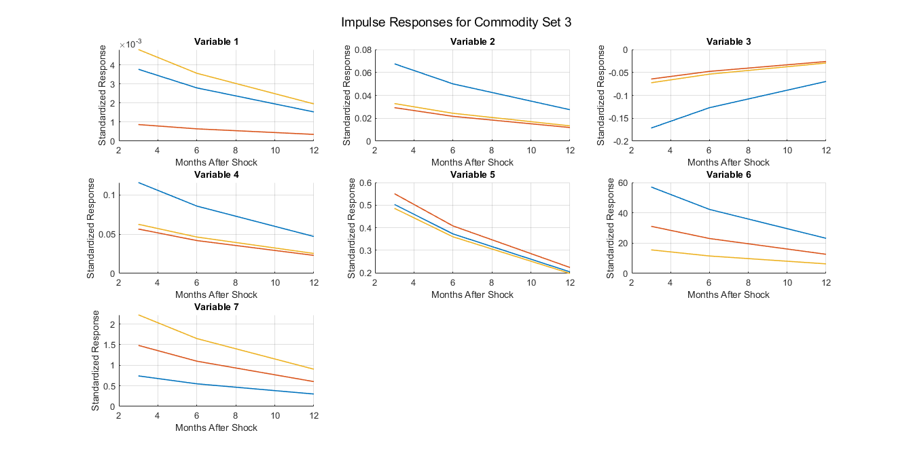
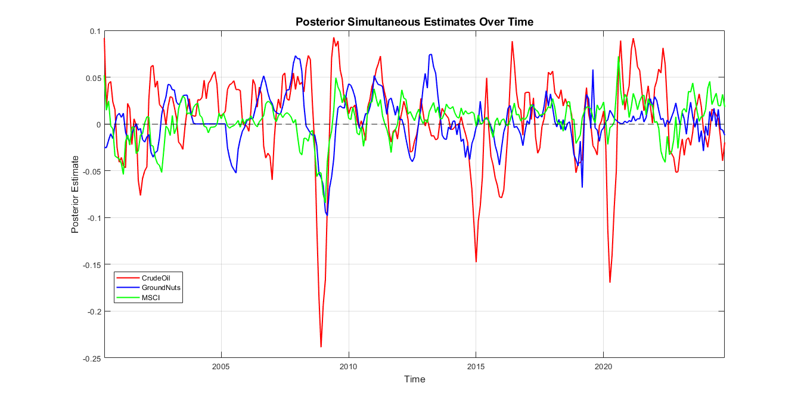

# TVP-VAR-SV Model

## Overview
This repository contains MATLAB implementations for estimating and analyzing **Time-Varying Parameter Vector Autoregressive (TVP-VAR) models with Stochastic Volatility (SV)**. These models are crucial for capturing dynamic relationships in time series data, allowing for changes in parameters and volatilities over time.

The repository includes scripts for:
- **Model estimation** using Bayesian techniques
- **Impulse response function (IRF) estimation**
- **Volatility spillover analysis**
- **Parameter visualization**
- **Data preprocessing** (log returns calculation, data import, etc.)

## Key Features
- **Bayesian Estimation of TVP-VAR-SV Models**
- **Dynamic Spillover Analysis**
- **Impulse Response Function Computation**
- **Time-Varying Parameter Visualization**
- **Log Returns Calculation for Financial Data**

## Repository Structure
```
├── data/               # Sample datasets for testing
├── scripts/            # MATLAB scripts for estimation and analysis
│   ├── estimateVARSV.m # Core function for TVP-VAR-SV estimation
│   ├── fitTVPVAR.m     # Bayesian fitting of TVP-VAR models
│   ├── netSpillovers.m # Spillover calculation function
│   ├── parameterPlots.m# Visualization of time-varying parameters
│   ├── impulseResponseEstimation.m # IRF computation
│   ├── calculateLogReturns.m # Data preprocessing script
│   ├── readData.m      # Function to import dataset
│   ├── rollingSamplePlots.m # Rolling window parameter analysis
├── results/            # Output files from model estimation
├── README.md           # Documentation
```

## Installation and Usage
### Prerequisites
- **MATLAB R2022a or later**
- **Statistics and Machine Learning Toolbox** (recommended)

### Running the Model
1. Clone the repository:
   ```bash
   git clone https://github.com/wajoel/tvp-var-sv-model.git
   cd tvp-var-sv-model
   ```
2. Open MATLAB and navigate to the repository directory.
3. Load your dataset or use a sample dataset from `data/`.
4. Run `estimateVARSV.m` to estimate the model:
   ```matlab
   results = estimateVARSV(data);
   ```
5. To compute impulse responses:
   ```matlab
   irf = impulseResponseEstimation(results);
   ```
6. To analyze spillovers:
   ```matlab
   spillovers = netSpillovers(results);
   ```
7. To visualize parameter evolution:
   ```matlab
   parameterPlots(results);
   ```

## Results
Below are outputs generated from the TVP-VAR-SV model:








## References
- Nakajima, J. (2011). "Time-Varying Parameter VAR Model with Stochastic Volatility: An Overview."
- Joshua Chan & Eric Eisenstat (2018). "Bayesian Model Comparison for TVP-VAR-SV Models."

## Contributing
Contributions are welcome! Feel free to open an issue or submit a pull request.

## License
This project is licensed under the MIT License - see the [LICENSE](LICENSE) file for details.

## Contact
For any inquiries, please reach out via GitHub Issues or email the repository owner.
